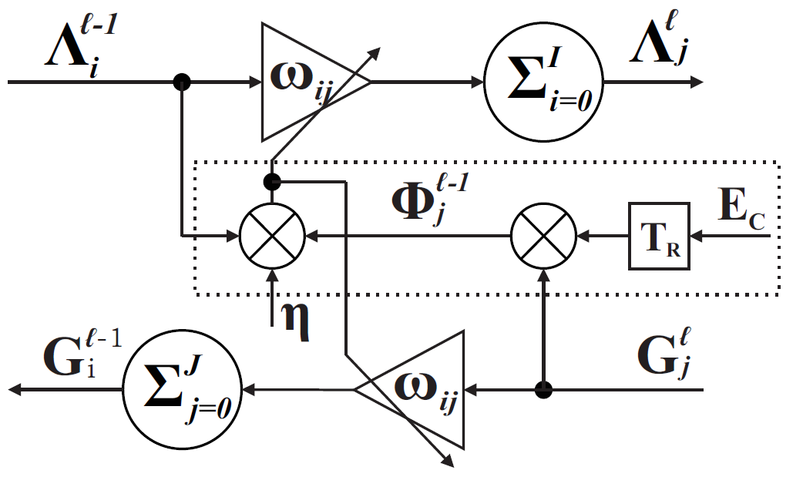

# clBP: closed-loop Back-Propagation
This repository is a csutom-written library for deep learning in the context of closed-loop systems. It can be used as an external library for your AI project. It also allows for creative learning rules such as local propagation of error or resonating the error in the netwrok.

## Building clBP
clBP uses cmake. just enter the clBP directory from the root and type:
- ``mkdir build && cd build``
- ``cmake ..``
- ``make``
- record the path to both the generated library file (``libclBP.a``) and of the ``include`` directory to be used in your project.
## a clBP neuron block diagram

